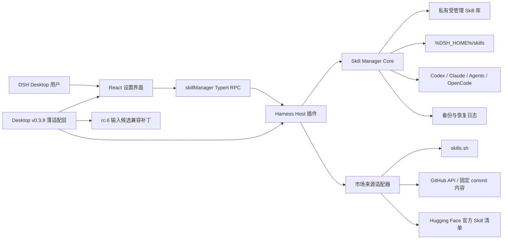
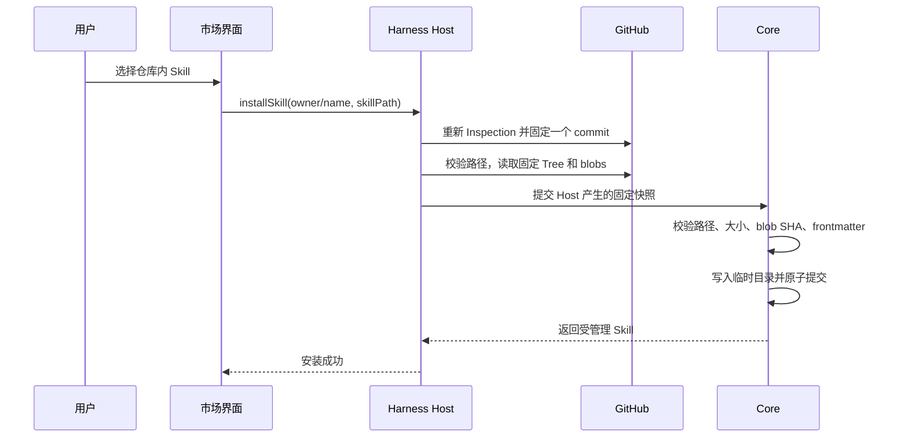

# DSH Skill Manager 项目详细概括

> 文档状态：当前项目总览
>
> 更新日期：2026-08-26
>
> 当前发布基线：DSH Desktop `0.5.4`、DeepSeek Harness `0.1.1-rc.2`；`0.3.8` / rc.6 仅保留为历史适配器
> 仓库状态：本地开发中，尚未发布 npm 包、GitHub Release 或上游 PR

## 1. 项目概述

DSH Skill Manager 是一个面向 DeepSeek Harness 与 DSH Desktop 的 Agent Skill 管理项目。它希望用同一套核心能力解决以下问题：

- 用户能够通过图形界面创建合法的 Skill，而不必手动建立目录和编写基础 `SKILL.md`。
- 用户能够统一查看、启用、停用、更新、备份和回滚自己的 Skill。
- 用户能够发现并导入 Codex、Claude Code、`.agents/skills` 与 OpenCode 已有的 Skill。
- 用户能够把同一份受管理 Skill 按需同步给多个 Agent 工具，同时避免复制相邻的 Agent 指令文件。
- 用户能够通过 skills.sh、GitHub 与 Hugging Face 等来源发现并安装远程 Skill。
- DSH Desktop 能够在设置页中提供完整的 Skill 管理界面，而不是依赖命令行或手工配置。
- 独立 Harness 插件与桌面端集成共用同一实现，桌面端只保留薄适配层。

项目当前采用“独立项目 + 桌面适配”的交付方向：

1. `@dsh-skill-manager/core` 提供与 DSH、Electron、React 无关的共享核心。
2. `dsh-skill-manager` 提供 DeepSeek Harness Host 插件、RPC 协议和 React 设置界面。
3. DSH Desktop v0.3.8 适配脚本将同一插件装配到桌面端，并处理该版本特有的输入候选兼容问题。
4. 项目成熟后，可以独立发布，同时向 DSH Desktop 提交只包含装配和兼容层的上游 PR。

## 2. 目标用户与典型场景

### 2.1 目标用户

- 使用 DSH Desktop、希望通过 GUI 管理 Skill 的普通用户。
- 使用 DeepSeek Harness、但不希望手动维护 Skill 目录和配置的用户。
- 同时使用 Codex、Claude Code、OpenCode 或 `.agents/skills` 的多工具用户。
- 希望从社区市场发现、安装和安全更新 Skill 的用户。
- 希望开发独立 Skill 管理生态或为 DSH Desktop 贡献功能的开发者。

### 2.2 典型使用场景

1. 用户在设置页创建一个写作 Skill，系统自动生成完整目录和基础 `SKILL.md`。
2. 用户开启 DSH 开关，Skill 出现在 Harness 原生 Skill 列表中，并在重启后保持启用。
3. 用户扫描 Codex Skill，只选择其中部分项目导入，不复制同目录下的 `AGENTS.md`。
4. 用户把一个受管理 Skill 链接到 Claude Code 和 OpenCode，后续更新立即对这些目标生效。
5. 用户在 Skill 市场按“历史热门”或“相关度”浏览 GitHub 仓库、查看来源和简介，然后在中央安装卡片中完成检查与安装。
6. 用户更新远程 Skill 前发现本地有改动，系统拒绝静默覆盖并保留恢复路径。
7. 用户在输入框开头连续输入 `/命令 /skill /命令 正文`；进入正文后，后续 `/` 不再误触发候选。

## 3. 当前范围与非目标

### 3.1 当前范围

- DeepSeek Harness 独立插件。
- DSH Desktop v0.3.8 设置页集成。
- Skill 创建、校验、管理、启用、同步、更新、备份和回滚。
- Codex、Claude Code、Agents、OpenCode 的元数据发现和显式同步。
- skills.sh、GitHub、Hugging Face 市场来源。
- DSH 原版、浅色、深色和跟随系统主题适配。
- v0.3.8 输入框前缀命令与 Skill 候选兼容。

### 3.2 当前非目标

- 不适配 DSH Desktop v0.3.9；该版本因已知回归被明确暂缓。
- 不修改或管理 `AGENTS.md`、`CLAUDE.md`、系统提示词和模型身份。
- 不把 Skill 管理器扩展成任意脚本或 Shell 宏执行器。
- 不执行远程 Skill 中包含的安装脚本或构建脚本。
- 不静默替换用户已有的同名目录、符号链接或目录联接。
- 不在本仓库中修复 Harness 的 Shell timeout；timeout 审计是独立任务。
- 未经用户授权，不提交 Git commit、不推送、不发布、不创建 PR。

## 4. 项目总体架构



架构遵循以下原则：

- 核心逻辑与 DSH Desktop 解耦。
- 浏览器只负责交互，不拥有文件系统和安装权限。
- Host 负责网络、路径、来源、快照和内容校验。
- 所有受管理目标共享一份规范 Skill bundle，而不是维护多份不可追踪副本。
- 市场发现数据不等于安装权限，安装前必须重新解析并固定远程快照。
- 名称和简介只用于发现候选，不能证明远程来源或更新权限。

## 5. 仓库结构

```text
dsh-skill-manager/
├─ packages/
│  ├─ core/                 # 共享核心、市场来源、存储和同步
│  └─ plugin/               # Harness Host、RPC、React 客户端和构建
│     └─ preview/           # 独立视觉预览环境
├─ scripts/
│  ├─ dsh-desktop-v038.mjs  # v0.3.8 装配与校验
│  ├─ verify-desktop-v038-ui.mjs
│  ├─ build-visual-preview.mjs
│  └─ serve-visual-preview.mjs
├─ docs/                    # 项目上下文、架构、接口、决策和状态
├─ package.json             # npm workspace 与统一命令
└─ README.md
```

### 5.1 `packages/core`

核心包不依赖 Electron、React 或 Cordis，主要负责：

- Skill 名称、描述、目录和 `SKILL.md` 校验。
- 私有 Skill 库与 registry 持久化。
- DSH 与外部 Agent 目标的启用状态。
- 外部 Skill 元数据发现、导入和链接。
- 市场搜索结果标准化和合并。
- GitHub 固定快照解析、bundle 下载和内容验证。
- 更新检查、备份、回滚和中断恢复。
- 输入框前缀语法的纯函数解析。

### 5.2 `packages/plugin`

插件包同时包含 Host 与 Client 两个面：

- `src/index.ts`：Cordis/Typert Host 服务和依赖装配。
- `src/rpc.ts`：版本化 RPC 请求、响应和 Handler。
- `src/typert.host.ts`：Host 侧严格 Typert 描述。
- `src/client-descriptors.ts`：客户端轻量 Remote 描述。
- `src/client.tsx`：设置入口与 Skill 管理 React 界面。
- `src/marketplace-fetch.ts`：Host 侧代理感知网络传输。
- `dist/index.js`：Host 构建产物。
- `dist/client.js`：浏览器构建产物。
- `dist/typert.host.js`：API 网关注册所需的 Host 描述产物。

插件导出 `./package.json`。这是 DSH Desktop v0.3.8 客户端模块注册器识别 `dsh.client` 的兼容要求，缺失时会出现 Host 加载成功但设置页客户端未挂载的问题。

### 5.3 Desktop v0.3.8 适配层

桌面适配层不复制业务逻辑，负责：

- 校验目标仓库确实是 DSH Desktop `0.3.8`。
- 校验 Harness 依赖为 `@deepseek-ai/dsh@0.1.0-rc.6`。
- 将完整插件 bundle 放入 Desktop `assets/plugins/dsh-skill-manager`。
- 更新 v0.3.8 的两条 companion 同步路径，确保 Host 和 Client 文件都被复制。
- 对 rc.6 输入候选依赖应用精确版本、可重复、失败关闭的补丁。
- 在隔离 DSH_HOME 和用户数据目录中运行真实桌面壳验证。

## 6. 核心数据模型

### 6.1 受管理 Skill

一个受管理 Skill 至少包含：

- `name`：规范名称。
- `description`：说明文本。
- `origin`：自设、本地导入、GitHub、skills.sh 或 Hugging Face。
- `enabledTargets`：当前启用的 DSH 或外部 Agent 目标。
- `contentHash`：完整 bundle 内容哈希。
- `createdAt`、`updatedAt`：管理时间。
- 可选来源信息：仓库、路径、commit、blob、bundle hash、目录来源和详情 URL。

### 6.2 受管理目录

核心维护以下逻辑区域：

- `library/`：规范 Skill bundle 的私有存储。
- `registry.json`：Skill 元数据、来源和启用状态。
- `backups/`：更新与回滚前保存的完整 bundle 和 registry 记录。
- 市场缓存：当前只包含内存级 skills.sh 历史适配器缓存；未来静态索引的磁盘缓存尚未实现。
- replacement journal：中断替换恢复所需的原子操作日志。

Harness Host 默认把 DSH 启用目标指向 `%DSH_HOME%/skills`，因为这是 v0.3.8 原生 Skill filesystem provider 能够扫描的位置。仅写入核心私有 `active/` 目录并不能使桌面端原生 Skill 列表看到该 Skill。

### 6.3 外部目标状态

Codex、Claude、Agents 和 OpenCode 的单个 Skill 目标状态分为：

- `not-configured`：目标根目录未配置或不可用。
- `not-linked`：目标中不存在该受管理 Skill。
- `linked`：目标准确链接到规范 bundle。
- `conflict`：同名路径存在，但不属于当前管理器。

管理器只删除自己创建且仍指向规范 bundle 的链接，不会删除普通目录或其他工具创建的链接。

## 7. 功能模块与实现措施

### 7.1 Skill 创建

用户在 UI 输入名称和描述后：

1. Client 发送版本化 `create` RPC。
2. Host 严格验证请求结构。
3. Core 验证名称、规范化路径并生成 Skill bundle。
4. 内容先写入临时同级目录。
5. 文件完整写入后再原子提交并更新 registry。
6. 新 Skill 默认不会自动替换任何已有目录。

该流程解决了 DSH 能读取 Skill、但原生界面不会替用户创建完整文件结构的问题。

### 7.2 DSH 启用与停用

- 启用时，在 `%DSH_HOME%/skills` 创建管理器拥有的单 Skill 链接。
- 停用时，只删除仍然准确指向规范 bundle 的管理器链接。
- 同名普通目录或未知链接显示为冲突，不会被覆盖。
- registry 与文件系统状态共同保证重启后的持久性。

### 7.3 多 Agent Skill 发现与同步

默认发现根目录为：

- Codex：`%USERPROFILE%/.codex/skills`
- Claude Code：`%USERPROFILE%/.claude/skills`
- Agents：`%USERPROFILE%/.agents/skills`
- OpenCode：`%USERPROFILE%/.config/opencode/skills`

发现阶段只读取直接子目录的 Skill 元数据，不把 Skill 正文、任意文件路径或相邻 Agent 指令发送到浏览器或模型上下文。

同步措施包括：

- 按来源单独扫描。
- 在 UI 中全选、取消部分项目、批量导入。
- 导入后保存规范副本和来源位置元数据。
- 对外同步采用每个 Skill 独立链接，不链接整个根目录。
- 更新和回滚规范 bundle 后，已链接目标立即看到相同内容。
- 无法证明远程来源的导入项归类为“自设”，但保留其扫描来源。

### 7.4 本地来源自动识别

可见的自设 Skill 可以触发一次受限来源检查：

1. Client 只把受管理 Skill 名称发送给 Host。
2. Host 在 GitHub 与 Hugging Face 目录中寻找候选。
3. 候选必须具有完全相同的解析名称和描述。
4. Host 固定远程 commit 并下载完整受限 bundle。
5. Core 比较远程 bundle 与未改动本地 bundle 的完整字节哈希。
6. 只有唯一完全一致结果才写入可更新来源。

同名、同简介但内容不同的仓库仍保持“自设”，不会获得更新权限。

### 7.5 自动标签

当前标签由 Client 根据显示中的名称和简介确定性生成：

- 不需要用户点击“添加标签”。
- 不调用额外模型或网络服务。
- 不修改用户的 `SKILL.md`。
- 同一名称和描述产生稳定标签。
- 标签只用于导航和理解，不参与来源证明或执行权限。

标签可覆盖代码、写作、设计、研究、游戏、创作、电商等常见方向，但它们属于提示性分类，不是权威内容审核。

## 8. Skill 市场

### 8.1 信息架构

设置界面明确分为两个区域：

- **Skill 管理**：本地 Skill、搜索、创建、启用、更新和同步。
- **Skill 市场**：GitHub 仓库候选、在线搜索、历史热门/相关度排序、按需详情和安装。

这样可以避免用户把“搜索已安装 Skill”和“搜索互联网市场”混为同一功能。

### 8.2 Marketplace V2 分层对象

当前市场不再使用一个条目同时代表仓库和 Skill，而是分成：

```text
RepositoryCandidate
  → RepositoryInspection
  → SkillDescriptor
  → 固定快照
  → InstalledSkill
```

列表阶段只读取 GitHub 仓库元数据。点击仓库后才固定一个 `inspectionCommit` 并读取 README、manifest、Tree 和 `SKILL.md` frontmatter。安装请求只携带 `owner/name + skillPath`，可信 commit、blob 和 bundle hash 均由 Host 产生。

### 8.3 市场来源

#### skills.sh

- 使用 skills.sh 官方 CLI 所消费的匿名榜单/搜索接口。
- 作为轻量发现、安装量和来源验证信号保留，不再直接驱动市场首页。
- 安装量只在 skills.sh 提供时显示，不能伪装成 GitHub 星级。
- 该接口属于非稳定内部接口，因此必须验证结构、缓存结果并明确报告失败。

#### GitHub

- GitHub 既是安装托管方，也是受限市场发现来源。
- 列表搜索只读取仓库 metadata；详情阶段才读取 README 和 Tree。
- 默认不会把该结果描述为“完整 GitHub Skill 市场”。
- GitHub repository stars 是仓库级指标，不是单个 Skill 的评分。
- 安装前必须解析准确 Skill 路径并固定 commit。

#### Hugging Face

- 当前读取 `huggingface/skills` 官方生成清单。
- Hugging Face 是目录标签和发现来源，当前安装仍由 GitHub 固定快照完成。
- 官方清单没有每个 Skill 的下载量、星级、截图或可靠作者头像，因此不能编造这些字段。
- 搜索无结果与来源不可用是不同状态，UI 必须分别显示。

### 8.4 发现信号与安装授权

Topic、仓库名、简介、skills.sh、Hugging Face 和未来索引都只能产生发现信号。只有目标路径中合法的 `SKILL.md` 才能产生结构验证。仓库 identity 是 `github:owner/repository`，Skill identity 是 `github:owner/repository#path`，不能只按名称去重。

### 8.5 安装流程



浏览器不能直接提交受信任的 commit、blob SHA、bundle hash 或本机安装路径。Host 会在安装时重新解析和验证，避免客户端篡改市场条目。

### 8.6 能力协商与当前运行证据

Client 进入市场时先调用 `getCapabilities`。旧 Host 会直接显示“请重启 DSH Desktop”，不再等到按钮调用后才暴露 HTTP 404。隔离 v0.3.8 真实 Shell 已验证 V2 Client 以 HTTP 200 加载、只显示“历史热门/相关度”、安全分类实时返回 20 个 GitHub 候选、16×18 折角图标生效，并在 Inspection 完成前显示 body-level Portal 安装卡片。

### 8.7 仓库详情、媒体与风险

详情视图已经支持 GitHub owner、头像/封面结构化媒体、README 仓库说明、多个 Skill、固定 commit 状态、批量选择、独立安装结果和风险提示。媒体安全措施为：

- 由 Host 解析并返回受限数据，不给浏览器任意 URL 读取能力。
- 只允许 GitHub avatar、Social Preview 和固定 commit 仓库图片。
- 限制重定向、MIME、字节、尺寸和解码像素；默认拒绝 SVG。

静态风险扫描与结构证据、安装完整性分开显示，检查脚本、网络、凭据/敏感路径、工具调用和破坏性模式。高风险需要二次确认，但不会宣称“绝对安全”。Inspection 只证明固定检查 commit 下的结构；完整 bundle 的字节、Git blob SHA 和哈希由 Host 在实际安装时重新验证。

- README 外部站点图片默认不接受。
- 限制图片 MIME、单图大小、重定向、解码尺寸和像素数。
- 图片失败时使用文字/首字母占位，不阻止详情和安装。
- 仓库列表每页默认 20 项，通过显式“加载更多”继续浏览。

## 9. 更新、备份与回滚

### 9.1 更新检查

更新只支持具有可信 GitHub 来源、且本地内容未被修改的 Skill：

- `unsupported`：没有受支持的远程来源。
- `local-modified`：当前 bundle 与已安装基线不同。
- `up-to-date`：远程固定快照与当前一致。
- `update-available`：远程存在不同的可验证快照。

客户端不能指定“更新到哪个 commit”；Host 在操作时重新解析最新远程快照。

### 9.2 持久备份

每次更新或回滚前，管理器都会保存：

- 完整旧 bundle。
- 旧 registry 记录。
- 内容哈希。
- 远程快照信息。
- 原因和时间。
- 管理器生成的不可猜测备份 ID。

备份在 DSH 重启后仍可查询，不依赖短期内存 undo token。

### 9.3 原子替换与中断恢复

替换流程使用临时目录、旧目录位移和持久 journal。重启时只自动恢复能通过旧/新哈希和 registry 状态证明的已知阶段；遇到未知或用户改动状态时停止并要求人工检查，不猜测性覆盖。

### 9.4 删除恢复区

删除与更新备份分开处理。用户删除受管理 Skill 后，完整 bundle 和原 registry 记录进入 `最近删除`，默认保留 30 天；界面显示到期时间并可一键恢复。恢复前 Host 会重新校验 bundle 哈希、Skill 名称、管理库路径和原先启用的工具目标，发生同名或目标冲突时拒绝覆盖。正常 Core 操作只会自动清理已过期、结构有效且哈希一致的管理器归档；损坏归档不会被静默删除或恢复。

### 9.5 自动维护与手动同步

- `自动匹配来源`、`自动检查更新`、`自动更新`是三个独立、默认关闭的本地偏好。
- 勾选后，在进入本机 Skill 管理并加载完成时后台运行；每项 24 小时最多运行一次。
- 自动更新只处理刚刚检查为 `update-available`、未被本地修改的 Skill，Host 仍会重新解析固定快照。
- `同步到其他工具`不是更新市场来源；它是一个手动操作，为 Codex、Claude Code、Agents 和 OpenCode 的已配置目录创建缺失的管理器单 Skill 链接，不复制 `AGENTS.md` 或 `CLAUDE.md`。

## 10. 输入框命令与 Skill 前缀

### 10.1 用户期望

允许：

```text
/command-one /skill-one /command-two 正文内容
```

规则是：

- 命令或 Skill 后仍可继续输入另一个 `/命令` 或 `/skill`。
- 只有普通正文开始后，后续 `/` 才作为普通字符。
- 不能因为正文中出现 `/` 就打开候选。
- 原生 `@` 行为、`+ 命令` 启动器和 Enter 提交必须保持不变。

### 10.2 v0.3.8 平台边界

Harness rc.6 的 Host 仍然只执行第一个原生命令，后面的文本作为该命令参数。当前适配解决的是输入和候选体验，不把一行文本改造成多个命令事务执行器。

### 10.3 适配措施

- 使用纯函数解析空白分隔的开头前缀链。
- 缓存原生命令和 Skill 来源实际返回过的名称，不硬编码命令表。
- 只有已知前缀 token 后的空白 `/` 才重新开启候选。
- 普通正文开始后关闭前缀模式。
- 补丁仅应用于准确 rc.6 依赖和已知源代码标记。
- 版本或标记漂移时失败关闭，不盲目修改未知版本。

## 11. 设置界面与视觉设计

### 11.1 信息结构

- 全部：显示所有受管理 Skill。
- 自设：显示无法证明远程来源的 Skill。
- 同步：扫描和管理 Codex、Claude、Agents、OpenCode。
- 市场：仓库候选、搜索、历史热门/相关度排序、按需详情和安装；近期热门等 Star 趋势待历史快照后实现。
- GitHub 市场：明确标注仓库搜索；代码、安全、设计、研究、写作、游戏、数据和效率分类会分别发起新的 GitHub 元数据搜索，不再筛选当前一页。结果仍只是候选，安装前必须检查准确 `SKILL.md`。
- 本地来源匹配：后台严格比较完整 Skill bundle；界面显示已匹配、未匹配、歧义、内容变化或暂时不可用，并允许逐项重试。

### 11.2 Skill 行设计

- 上方显示 Skill 名称。
- 下方以灰色单行显示简介。
- 简介溢出时截断，悬停显示完整内容。
- 自动显示内容类型标签。
- 根据上下文显示启用开关、安装、更新、同步或冲突状态。
- 使用简单纸张轮廓和一个折角的文件图标，不包含 `<>` 代码符号。

### 11.3 设置侧栏图标

DSH v0.3.8 的 `settings.section` 只接受 id、order 和 label，原生壳会为未知设置项硬编码齿轮。插件客户端因此只替换自己的“Skill 管理”侧栏图标，并在卸载时恢复原节点。

用户反馈原始替换 SVG 过大后，最新构建已把图标的宽高、最小/最大尺寸和 flex 约束固定为 `16 × 18 px`，同时限制 overflow、box sizing 和 transform。隔离 v0.3.8 真实 Shell 已通过 `getBoundingClientRect()` 验证实际尺寸为 16×18；2026-08-19 的 Protocol 5 完整包已在回滚备份后同步到用户的 profile 与便携 Desktop。

### 11.4 主题适配

界面不固定为深色，而是映射 DSH v0.3.8 的语义主题变量：

- 原版主题。
- 浅色主题。
- 深色主题。
- 跟随系统。

独立预览环境提供回退色，但真实桌面端优先使用 DSH 原生 surface、border、foreground、hover 和 accent tokens。

## 12. RPC 接口概括

当前 `skillManager` namespace 使用 `schemaVersion: 1`，公开 24 个 Protocol 5 Host RPC。Marketplace V2 已直接替换旧的四个市场方法；`installRepository` 以仓库为下载和分析单元批量安装其中的独立 Skill，`verifyProvenanceBatch` 最多批量验证 20 个本地 Skill：

| 方法 | 作用 |
| --- | --- |
| `list` | 列出受管理 Skill |
| `create` | 创建 Skill |
| `setEnabled` | 启用或停用 DSH 目标 |
| `getCapabilities` | 协商 Marketplace V2 能力和 Host build |
| `searchRepositories` | 搜索 GitHub 仓库元数据候选 |
| `browseRepositories` | 按历史热门或相关度浏览 GitHub 仓库候选 |
| `inspectRepository` | 固定 commit 并读取仓库详情和 Skill 描述 |
| `installSkill` | 仅按仓库 identity + Skill path 安装 |
| `installRepository` | 按仓库批量安装全部或选中的 Skill，并隔离每项结果 |
| `assessSkillRisk` | 静态风险扫描 |
| `resolveMedia` | 解析受限 GitHub 媒体引用 |
| `verifyProvenance` | 验证自设 Skill 的准确远程来源 |
| `verifyProvenanceBatch` | 批量匹配本地 Skill 来源，复用仓库快照 |
| `checkUpdates` | 检查更新状态 |
| `update` | 安全更新 Skill |
| `listBackups` | 查询持久备份 |
| `rollback` | 回滚到指定备份 |
| `delete` | 可恢复地删除受管理 Skill |
| `listTrash` | 列出 30 天内可恢复的删除归档 |
| `restoreTrash` | 校验冲突与完整性后恢复删除归档 |
| `discoverExternal` | 扫描外部 Agent Skill |
| `importExternal` | 导入指定外部 Skill |
| `listTargetStates` | 查询外部目标链接状态 |
| `setTargetEnabled` | 创建或移除指定目标链接 |

RPC 采用严格 Host schema。错误通过稳定 code 和安全 message 返回，浏览器不会收到代理凭据、任意文件路径、Skill 正文或内部异常堆栈。

## 13. 网络与代理

市场网络请求由 Host 统一执行：

1. 优先读取 `HTTPS_PROXY`、`HTTP_PROXY`、`ALL_PROXY` 等显式环境变量。
2. Windows 下没有显式变量时，可读取启用的当前用户静态代理。
3. 只允许 HTTPS GET 市场请求。
4. 代理地址和凭据不进入 Client payload。
5. 网络失败转换成市场来源级错误，不让浏览器获得底层传输细节。
6. 每个 Host 市场传输实例复用一个 keep-alive 代理 Agent，避免多 Skill Inspection 为每个 blob 重建代理/TLS 连接。

该措施用于解决用户机器启用了 Windows 本地代理，但 Node 原生 `fetch` 默认不会自动遵循系统代理的问题。

## 14. 安全边界

### 14.1 远程内容

远程仓库、README、图片、Skill 文档和脚本均视为不可信数据：

- 发现阶段不执行脚本。
- 安装阶段不运行 `postinstall` 或 Skill 自带构建命令。
- 不把远程 Markdown 当作系统指令。
- 不把仓库名称或简介当作来源证明。

### 14.2 GitHub bundle 校验

安装和更新至少执行以下限制：

- 固定 commit SHA。
- 获取完整且未截断的仓库树，必要时安全回退。
- 只接受目标 Skill 目录内普通文件。
- 拒绝 symlink 和 submodule。
- 拒绝绝对路径、父目录逃逸和跨平台危险名称。
- 限制文件数量、单文件大小和总大小。
- 根据下载字节重新计算 Git blob SHA。
- 校验准确 `SKILL.md` 与 frontmatter。
- 完整 bundle hash 与 registry 一致后才提交。

### 14.3 本地文件系统

- Browser 不提交任意路径。
- 所有根目录由 Host 配置决定。
- 只操作管理器自己拥有的 library、registry、backup 和链接。
- 不覆盖无法证明归属的同名路径。
- 删除只针对仍指向规范 bundle 的管理器链接。

## 15. 测试与验证体系

### 15.1 自动化命令

```powershell
npm test
npm run typecheck
npm run build
npm run desktop:v038:stage -- --desktop C:\path\to\dsh-desktop
npm run desktop:v038:verify -- --desktop C:\path\to\dsh-desktop
npm run desktop:v038:ui
npm run visual:build
```

### 15.2 测试层次

- Core 单元测试：临时文件系统、创建、导入、更新、回滚和恢复。
- 市场来源测试：正常响应、结构错误、限流、超时、取消和部分失败。
- RPC 测试：请求/响应 schema、错误 code 和权限边界。
- Client 测试：React 用户交互、搜索、筛选、标签、同步和设置注册。
- Build 验证：Host、Client、Typert 构建产物和 package exports。
- Visual Preview：桌面和 390px 宽度、四种主题、无横向溢出和控制台错误。
- Desktop Adapter：准确 v0.3.8 双次装配、幂等性和依赖补丁校验。
- 隔离真实壳：设置入口、市场、创建、启用、重启持久性、外部同步和 Composer 输入。

### 15.3 已记录验证证据

最近完整回归通过：

- 20 个 Vitest 文件、172 个当前测试；另有 8 个明确跳过的 V1/备份 UI 历史用例。
- TypeScript project typecheck。
- npm workspace build。
- Host/client bundle verification。
- 最终安全补丁后重新执行的准确 v0.3.8 stage/verify。
- skills.sh 真实榜单 Host 探测。
- `anthropics/skills` 真实 Host 代理 Inspection：7,305 ms、固定 commit `f379e5a`、20 个 Skill descriptor。
- 隔离桌面壳市场、同步、重启和输入交互。
- 参考图与旧版弹窗的同屏视觉对照，以及本轮 1280×833 暗色 720px Portal 弹窗验收；本轮 520px 新截图工具超时，未将其表述为重新验证通过。
- Client 139,220 字节产物验证、16 文件 npm 打包干跑、安装文件语法检查和 Host ESM import。
- 双目录完整包逐文件 SHA-256 一致；精确 v0.3.8 隔离真实壳代替缺少独立 `dsh` CLI 的 live profile 执行运行时装配验证。

这些结果证明对应构建切片通过；隔离真实 v0.3.8 Shell 还验证了 Client HTTP 200、市场能力协商、仅两个有效排序、放大的安装点击区、Portal 弹窗加载态、折角文件图标、创建/启用重启持久化、外部同步和输入边界。2026-08-18 的实际便携版验收进一步确认 GitHub 候选、分类、本地批量操作、删除入口和持久化来源状态均已加载。

## 16. 当前项目状态

### 16.1 已实现并有测试覆盖

- Skill 创建、管理和 DSH 启用。
- 外部 Agent Skill 发现、导入和单 Skill 链接。
- 来源分类、目标状态和冲突保护。
- skills.sh、受限 GitHub、Hugging Face 市场来源。
- Marketplace V2 仓库搜索/浏览、按需 Inspection、多 Skill 批量安装和逐项失败隔离。
- 固定 commit 快照、root manifest 安全文件边界、媒体限制和静态风险扫描。
- GitHub 固定快照安装、更新、备份和回滚。
- 30 天删除恢复区、冲突安全恢复和过期清理。
- 默认关闭的来源匹配/更新检查/自动更新维护策略，以及清晰的手动跨工具同步。
- 自动内容标签和准确来源验证。
- v0.3.8 设置页、主题和输入候选适配。
- 独立预览与隔离真实桌面壳测试工具。

### 16.2 已写入代码但仍需用户运行实例验收

- 用户正在运行的 Desktop 进程是否已手动重启并加载 2026-08-18 06:42 装配的当前 bundle。
- 用户实际 Desktop 弹窗是否通过同一 Host 代理完成多 Skill Inspection。
- 用户真实 Skill 库上的来源分类和批量同步体验。

### 16.3 已批准设计但尚未实现

- 中央 Indexer 服务和 GitHub Actions 定时索引发布。
- 历史快照驱动的真实趋势算法、索引签名/Sigstore/TUF。
- 细化的媒体缓存策略和详情画廊增强。

### 16.4 暂缓

- DSH Desktop v0.3.9 适配和验证。
- GitHub 推送、Release 和上游 PR。
- Harness timeout 修复。

## 17. 当前主要问题与根因

| 问题 | 当前判断 | 处理方向 |
| --- | --- | --- |
| 旧市场 HTTP 404 | 旧 Client/Host 运行时路由错位 | V2 能力协商、完整同步、手动重启 |
| GitHub Inspection 超时 | 多 Skill blob 并发与每请求重建代理/TLS 连接共同放大延迟 | 并发限制、短暂重试、复用 keep-alive 代理 Agent；仍保留总 deadline |
| skills.sh 稳定性 | 榜单接口为官方 CLI 使用的非稳定内部接口 | 严格验证、缓存、失败显式化 |
| Hugging Face 数据较少 | 官方清单不提供完整市场指标和截图 | 只显示真实字段，不推测或伪造 |
| 本地来源误判风险 | 名称和简介可复制，无法证明所有权 | 固定快照与完整 bundle 字节一致性 |
| 多 Agent 上下文污染 | 整根目录同步可能携带 `AGENTS.md` 等文件 | 只发现和链接直接 Skill 子目录 |
| timeout 看似存在但可能无效 | 参数可能没有进入取消链路，`handle.done` 可持续等待 | 在独立 Harness 审计中检查取消和子进程清理 |

## 18. 下一阶段实施顺序

### 第一阶段：用户实例重启验收

1. 构建当前 workspace。
2. 将完整 `dist`、package manifest 和 patch 同步到 Desktop 与 Harness。
3. 校验 `index.js`、`client.js`、`typert.host.js` 和 `package.json` 哈希。
4. 用户手动重启 DSH Desktop。
5. 验证仓库候选、关键词搜索、Inspection 和来源失败提示。
6. 确认用户代理对 GitHub API 的连通性；超时应显示稳定错误，不应伪装为 404。

### 第二阶段：中央索引与媒体增强

1. 实现 GitHub/skills.sh/Hugging Face Indexer。
2. 发布并校验 `repositories.jsonl.gz`、`skills.jsonl.gz`。
3. 增加历史快照后再启用趋势排序。
4. 扩展媒体缓存和详情画廊。

### 第三阶段：真实本机同步验收

1. 分别扫描 Codex、Claude、Agents 和 OpenCode。
2. 测试全选、取消部分项目和批量导入。
3. 验证无来源 Skill 进入“自设”。
4. 验证准确匹配后获得更新能力。
5. 验证同名冲突不被覆盖。
6. 验证更新和回滚传播到已链接目标。

### 第四阶段：项目交付准备

1. 整理本地改动为可审查提交。
2. 完成独立项目 README、安装说明、截图和版本策略。
3. 明确独立 Harness 插件发布包。
4. 提取最小 DSH Desktop v0.3.8 适配提交。
5. 用户授权后再推送独立仓库或提交桌面端 PR。

### 独立任务：Harness timeout 审计

timeout 项目应检查每种模式的：

```text
配置定义
  → 参数传递
  → Abort/取消信号
  → 子进程终止
  → handle.done 结束
  → 工具结果返回
  → UI 状态恢复
```

该审计不与 Skill Manager 功能提交混合，以便分别定位、验证和提交。

## 19. 开发与协作约束

- 使用 npm workspaces 和 TypeScript。
- Core 保持与 Electron、Cordis 和 React 解耦。
- 优先通过公开 API、RPC Handler 和用户交互测试行为。
- 远程仓库始终视为不可信数据。
- 不执行远程 Skill 脚本。
- 所有产品改动同步更新项目文档和任务状态。
- 不把单元测试通过表述为用户当前运行实例已经生效。
- 保留用户现有脏工作树，不重置或覆盖无关改动。
- 未经授权，不执行提交、推送、发布、PR 或自动重启桌面端。

## 20. 相关文档

- `README.md`：仓库入口和常用命令。
- `docs/PROJECT_CONTEXT.md`：项目目的、用户和当前状态摘要。
- `docs/TASK_STATUS.md`：活动目标、实施记录和验证证据。
- `docs/ARCHITECTURE.md`：模块边界、数据流和安全边界。
- `docs/API_SPEC.md`：RPC 和核心公开接口。
- `docs/DECISIONS.md`：架构与产品决策记录。
- `docs/REQUIREMENTS_MATRIX.md`：需求、实现证据与剩余证明。
- `docs/TESTING.md`：测试策略和执行方式。
- `docs/ENVIRONMENT.md`：本地运行、装配和环境边界。
- `docs/LESSONS_LEARNED.md`：已确认故障、根因和预防方式。

## 21. 项目一句话总结

DSH Skill Manager 是一个以安全、可恢复、可验证为核心的跨 Agent Skill 管理平台：它使用独立核心统一管理 Skill，通过 Harness Host 控制文件和网络权限，在 DSH Desktop v0.3.8 中提供主题自适应 GUI，并以固定 GitHub 快照、完整 bundle 校验、显式同步和持久备份保证市场安装与多工具共享不会静默破坏用户数据。
